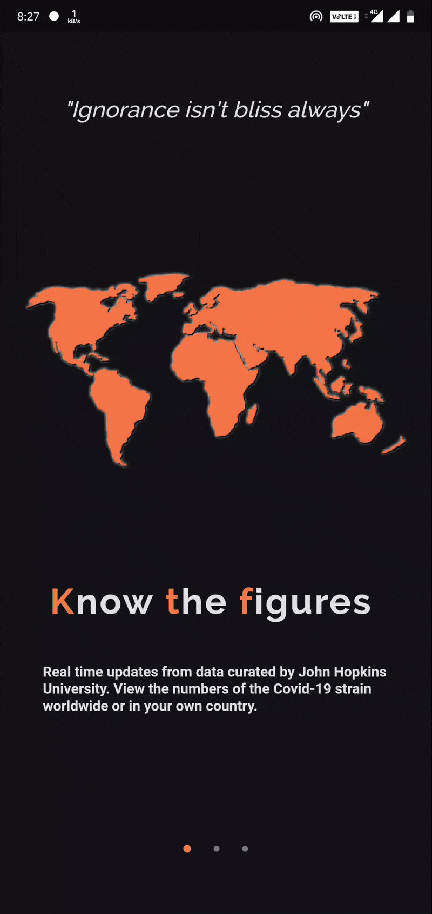
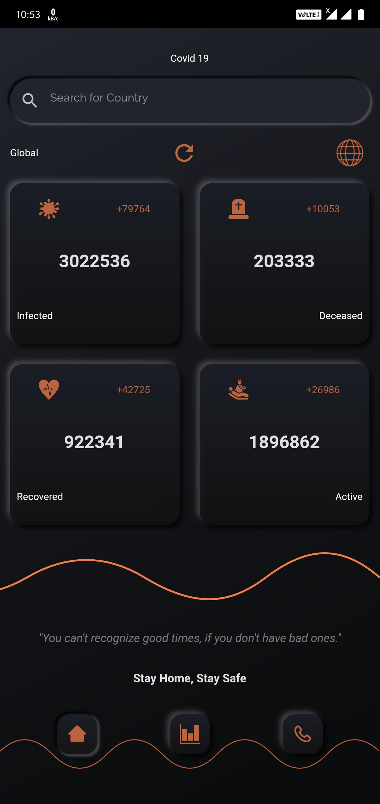
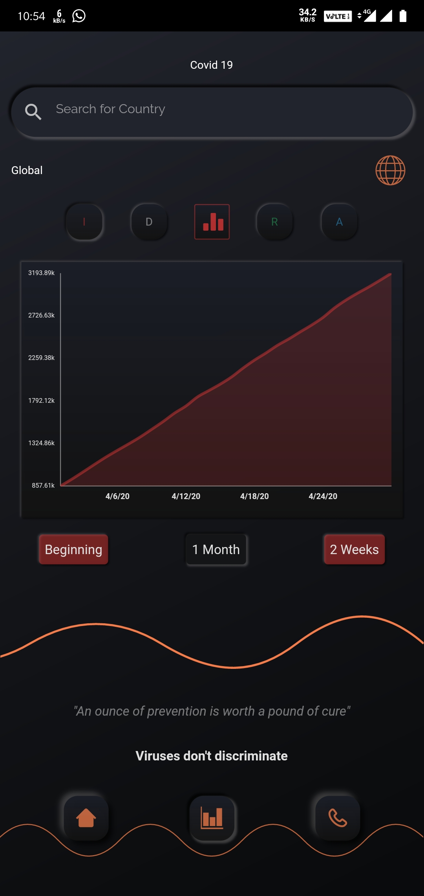
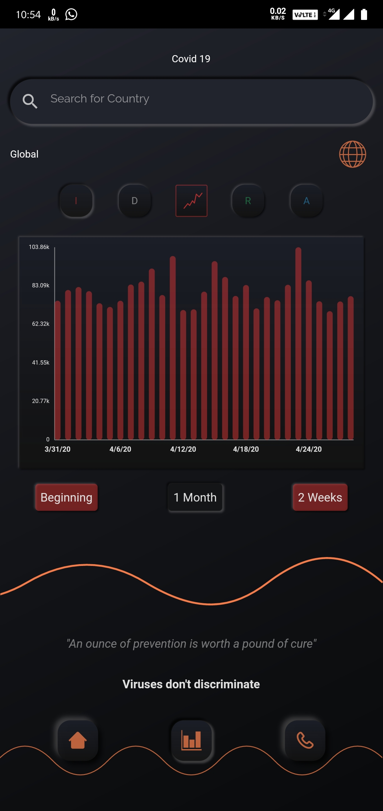
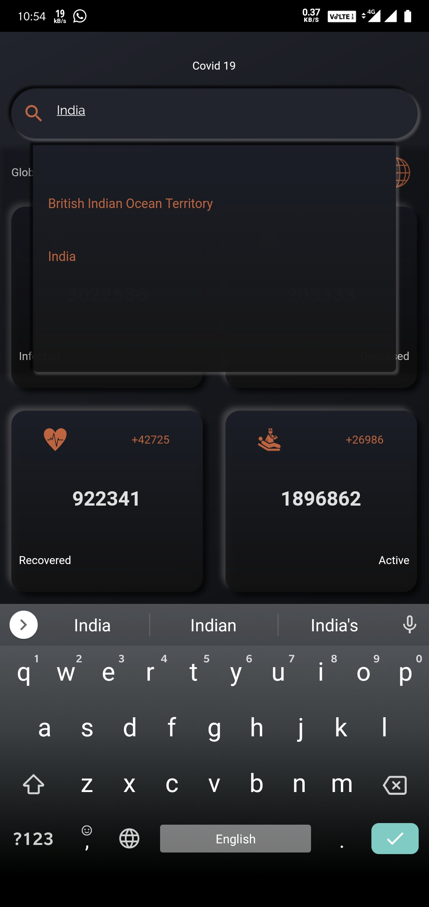
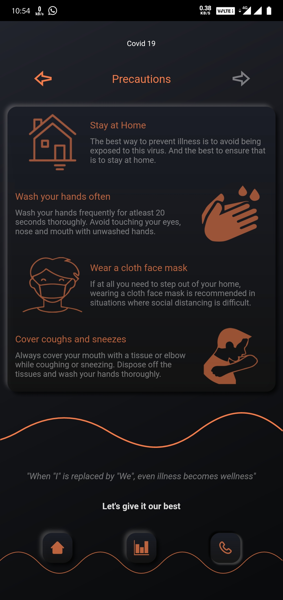

# Covid-19 Tracker

A minimal android app with a neomorphic touch, providing statistics of COVID-19 cases around the world. Detailed cumulative and daily graphs are available for all countries, along with some useful information like important links and precautions.

This is the first application I have made using Flutter for android. Still a noob, so feel free to suggest any changes to make it better:sweat_smile:

### FEATURES :
- Global numbers for COVID-19 updated on a frequent basis.
- Detailed statistics for each country.
- Cool graphs for viewing the trends in the virus strain.
- Important Links and other necessary information

### DOWNLOAD :
 [Version 1](https://drive.google.com/open?id=1i8Mv7_qkTnq9JVGJ6pTyOPrr-RZXQByx)
 
### TO-DO :
- [ ] Create feature graphic
- [ ] Publish to aptoide.com
- [ ] Add a simple state management system like Provider
- [ ] Cache Data

### SCREENSHOTS: 
 |
 |
 |
 |

 | 
 |
 

### APIs Used

- https://covid19api.com/
- https://github.com/NovelCOVID/API

### Libraries Used
- [FL Chart](https://github.com/imaNNeoFighT/fl_chart)
- [Liquid Swipe](https://github.com/iamSahdeep/liquid_swipe_flutter)

Made with ❤ by Arpan in Flutter.